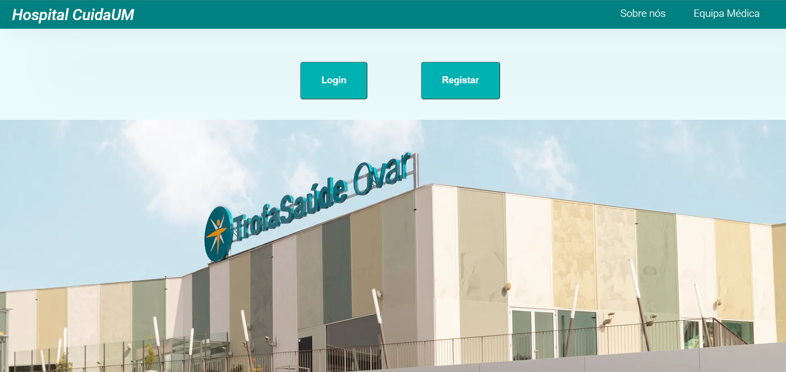
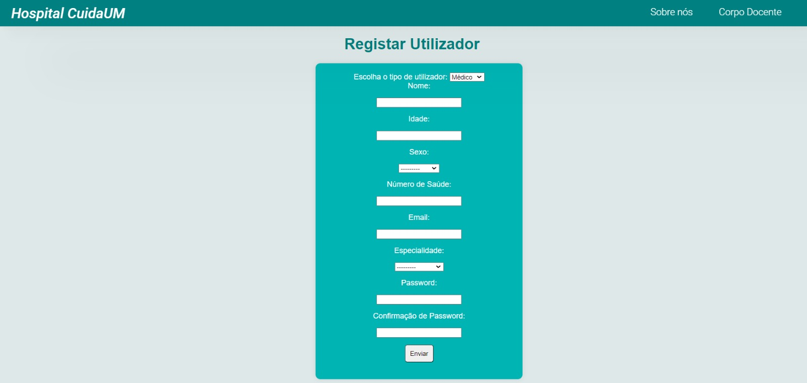
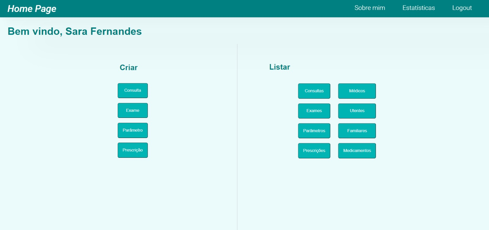
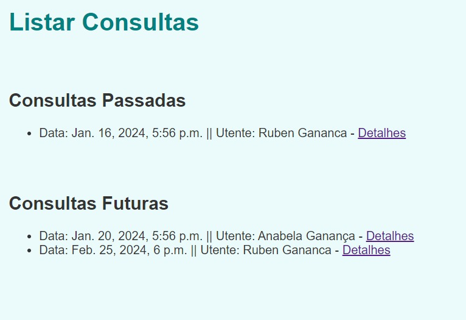
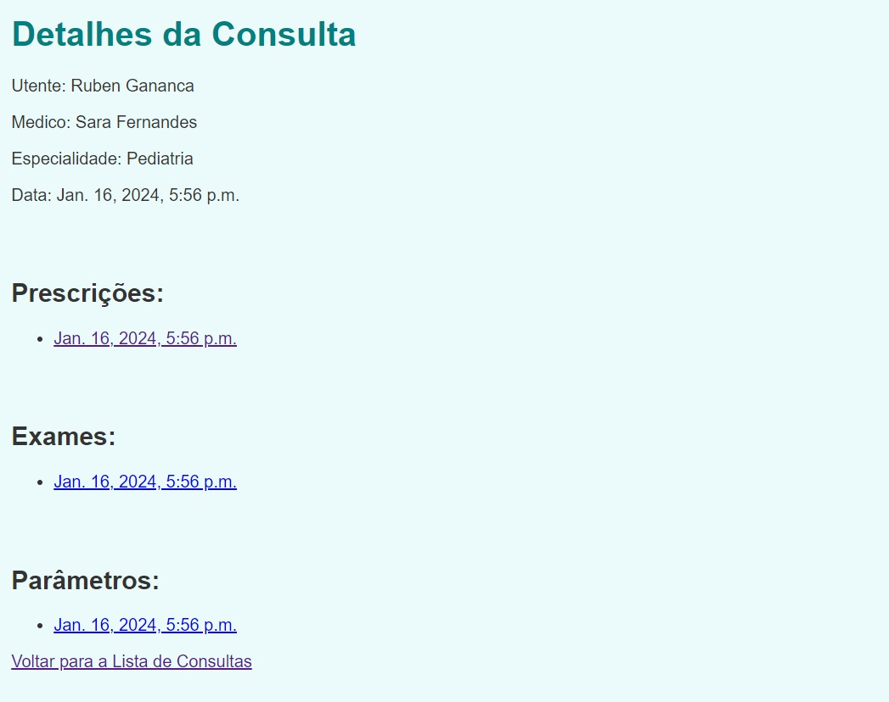

# Healthcare Management System

Academic project developed during university coursework focused on healthcare information management systems.

The project consists of two different implementations of the same healthcare platform, using distinct technologies and architectures.

---

# Project Overview

The system was designed to simulate interactions between:
- Patients
- Patient family members
- Healthcare professionals

Depending on the user role, the platform allows:
- Viewing patient information
- Managing appointments
- Requesting medical prescriptions
- Requesting clinical exams
- Updating healthcare records
- Communication between users and healthcare professionals

---

# Trabalho1 — Java Client-Server Application

Terminal-based healthcare management application developed in Java using a client-server architecture.

## Features

- Authentication and role-based access
- Patient and healthcare professional interactions
- Appointment management
- Prescription and exam requests
- Healthcare record management
- Client-server communication handling

## Technologies Used

- Java
- Object-Oriented Programming (OOP)
- Client-Server Architecture
- Terminal Application Development

---

# Trabalho2 — Web-Based Healthcare Platform

Web version of the healthcare management system developed using Django.

The application migrated the terminal-based interactions into a web interface with dedicated pages and forms.

## Features

- User authentication
- Role-based access control
- Patient data visualization and management
- Appointment and prescription management
- Web-based healthcare workflows

## Technologies Used

- Django
- Python
- HTML
- CSS
- Web Development

## Screenshots

  
  
  
  
  

---

# Learning Outcomes

This project allowed the development of skills related to:
- Backend development
- Software architecture
- Client-server communication
- Web application development
- Object-oriented programming
- Database-driven systems
- Role-based systems design
